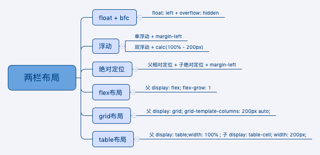

## 两栏布局（左边固定宽度，右边自适应）

```html
<div class="container">
  <div class="left"></div>
  <div class="main"></div>
</div>
```

```css
* {
  padding:0;
  margin:0;
}
.container {
  position: relative;
  width: 100%;
  height: 600px;
}
.left {
  background: pink;
  height: 100%;
}
.main {
  background: green;
  height:100%;
}
```

1. float + bfc

```css
.left {
  width: 280px;
  float: left;
}
.main {
  overflow: hidden;
}
```
2. 浮动

- 单浮动

```css
.left {
  width: 280px;
  float: left;
}
.main {
  margin-left: 280px;
}
```

- 双浮动

```css
.left {
  width: 280px;
  float: left;
}
.main {
  float: left;
  width: calc(100% - 200px)
}
```
3. 绝对定位

```css
.left {
  width: 280px;
  position: absolute;
}
.main {
  margin-left: 280px;
}
```
4. flex布局

```css
.container {
  display: flex;
}
.left {
  width: 280px;
}
.main {
  flex: 1; // flex: 1 1 0;
}
```
5. 双inline-block

```css
.container {
  box-sizing: content-box;
  font-size: 0;     /* 消除空格的影响 */
}

.left, 
.main {
  display: inline-block;
  vertical-align: top;
  box-sizing: border-box;
}

.left {
    width: 400px;
}
.main {
  width: calc(100% - 400px);
}
```

6. grid布局

```css
.container {
  display: grid;
  grid-template-columns: 280px auto;
}
```
7. table布局 

```css
.container {
  width: 100%;
  display: table;
}
.left {
  width: 280px;
  display: table-cell;
}
```
## 三栏布局（左边固定宽度，右边固定宽度，中间自适应）

```html
<div class="container">
  <div class="left"></div>
  <div class="main"></div>
  <div class="right"></div>
</div>
```

```css
* {
  padding:0;
  margin:0;
}
.container {
  position: relative;
  width: 100%;
  height: 600px;
}
.left {
  background: pink;
  height: 100%;
}
.main {
  background: green;
  height:100%;
}
```
1. 

## 上中下布局（头部底部固定，中间填满屏幕）

```html
<html>
  <head></head>
  <body>
    <div class="container">
      <div class="header"></div>
      <div class="main"></div>
      <div class="footer"></div>
    </div>
  </body>
</html>
```
1. 定位 + padding

```css
html, body {
  margin: 0;
  padding: 0;
  height: 100%; // ！重要
}
/* .container {
  position: relative;
  height: 100%;
} */
.header {
  position: absolute;
  top: 0;
  width: 100%;
  height: 50px;
  background: red;
  z-index: 99;
}
.footer {
  position: absolute;
  bottom: 0;
  width: 100%;
  height: 50px;
  background: red;
}
.main {
  height: 100%;
  padding-top: 50px;
  padding-bottom: 50px;
  background: pink;
  box-sizing: border-box;
}
```
2. 绝对定位

```css
html, body {
  margin: 0;
  padding: 0;
  height: 100%; // ！重要
}
.header {
  position: absolute;
  top: 0;
  width: 100%;
  height: 50px;
  background: red;
  z-index: 99;
}
.footer {
  position: absolute;
  bottom: 0;
  width: 100%;
  height: 50px;
  background: red;
}
.main {
 position: absolute;
 top: 50px;
 bottom: 50px;
 width: 100%;
 background: pink;
}
```

3. flex布局

```css
html, body {
  margin: 0;
  padding: 0;
  height: 100%; // ！重要
}
.container {
  display: flex;
  flex-direction: column;
  height: 100%;
}
.header, .footer {
  flex-basis: 50px;
  background: red;
}
.main {
  flex: 1;
  background: pink;
  overflow: auto;
}
```
