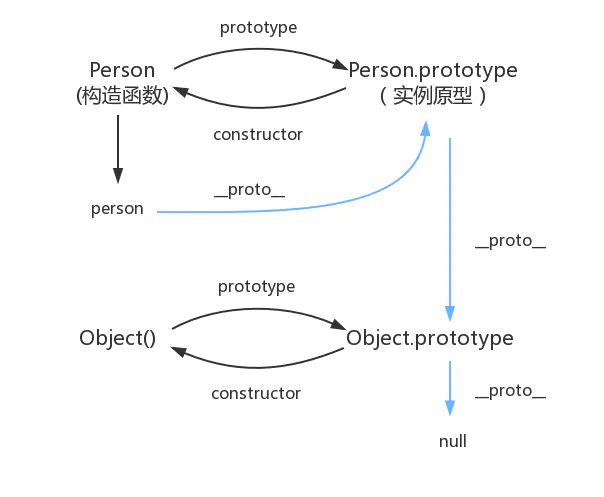
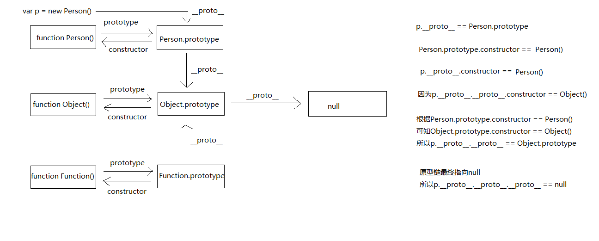

构造函数、原型和实例的关系：

> 红宝书上如此描述：每个构造函数都有一个原型对象，原型对象都包含一个指向构造函数的指针，而实例都包含一个指向原型对象的内部指针。

### 原型

任何函数的本质都是对象

- 每一个函数都有一个属性prototype，所对应的值叫原型
- (通过构建函数创造的)每一个对象实例都有一个关联对象——也就是原型，__proto__指向原型，它会继承该原型的所有属性
- 每个原型都有一个 constructor 属性指向关联的构造函数，实例原型指向构造函数

注意：

- __proto__属性没有写入 ES6 的正文，ES6建议用

- 读操作：`Object.getPrototypeOf(obj)`
- 写操作： `Object.setPrototypeOf(obj, prototype)`
- 生成操作：`Object.create(prototype)`

### 原型链

把原型对象当做一个实例，那么它也会有一个指向另一个原型对象的内部指针，如此层层递进，形成原型链

原型链最重要的作用就是用来属性查找

如下图





### 构造函数和class区别

1. 构造函数内定义的都是实例属性与实例方法，定义原型属性和方法采用`prototype`方式
2. `class`不能直接定义原型上的属性，可以采用`prototype`方式
3. `class`顶部可以直接定义实例属性
4. `class`的`constructor`内既可以定义实例方法也可以定义实例属性
4. `class`内定义的方法（非`constructor`内）是原型上的方法

思考：

- `Object instanceof Function`
- `a.toString()`和`Object.toString()` => `Function`
以下代码是等价的

```js
function A (age) {
  this.name = 'A'
  this.age = age
  this.fn = function () {
    console.log('我是实例方法')
  }
}
A.prototype.fns = function () {
  console.log('我是原型方法')
}
```
```js
class A () {
  name = 'A' // 实例属性 还可以写在constructor内
  constructor (age) {
    this.age = age
    this.fn = function () {
      console.log('我是实例方法')
    }
  }
  fns = function () {
    console.log('我是原型方法')
  }
}
```